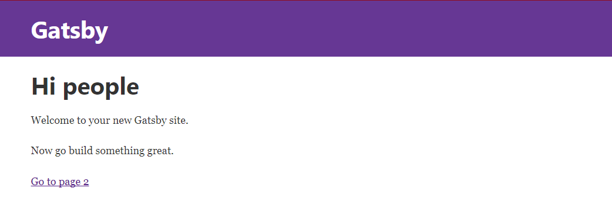
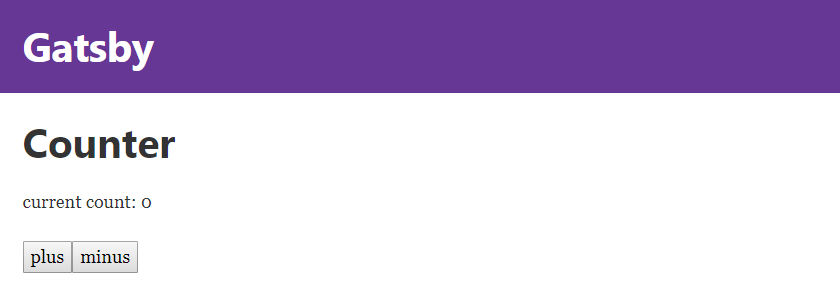

# gatsby-starter-default
The default Gatsby starter

For an overview of the project structure please refer to the [Gatsby documentation - Building with Components](https://www.gatsbyjs.org/docs/building-with-components/)

Install this starter (assuming Gatsby is installed) by running from your CLI:
```
gatsby new gatsby-wiki
```

1. [Start your Gatsby Development Environment](#start-your-gatsby-development-environment)
2. [Adding Content and Linking Pages](#adding-content-and-linking-pages)
3. [Styling your JSX](#styling-your-jsx)
4. [Adding Interactive Components](#adding-interactive-components)
5. [Importing Components to your Sites](#importing-components-to-your-sites)
6. [Passing down Props](#passing-down-props)
7. [Build the Static Page](#build-the-static-page)
---


## Start your Gatsby development environment


Now change into your site directory and run the Gatsby development environment using npm:

```
cd gatsby-wiki

npm run development
```

You can now access your website on http://localhost:8000 :





## Adding content and Linking Pages


The */src/pages/index.js* file contains regular JSX - add any HTML inside the /<div/> tag to make it appear inside your website (Gatsby is hot-reloading).

```js
import React from 'react'
import Link from 'gatsby-link'

const IndexPage = () => (
  <div>
    <h1>Hi people</h1>
    <p>Welcome to your new Gatsby site.</p>
    <p>Now go build something great.</p>
    <Link to="/page-2/">Go to page 2</Link>
  </div>
)

export default IndexPage
```

You need to import Link from gatsby-link to use the Link Component and link to other pages - above you see the:

```html
<Link to="/page-2/">Go to page 2</Link>
```

component, linking our **index.js** page to another page inside the same folder with the name **page-2.js**. Every js file inside the */src/pages* folder will automagically be routed by Gatsby!


## Styling your JSX


You can use simply add inline styles to your component, e.g.

```js
const IndexPage = () => (
  <div style={{color: 'tomato', background: 'blue'}}>
    <h1>Hi people</h1>
    <p>Welcome to your new Gatsby site.</p>
    <p>Now go build something great.</p>
    <Link to="/page-2/">Go to page 2</Link>
  </div>
)
```


## Adding Interactive Components


React allows you to add interaction to your page - we want to add a counter, set it's state to 0 on load and have two buttons that use onClick events to increment or decrement the state of the counter.

We can just add a new file */src/pages/counter.js* and link to it from the index page *\<Link to="/counter/"\>Go to Counter\</Link\>*:

```js
import React from 'react'

class Counter extends React.Component {
  constructor() {
    super()
    this.state = { count: 0 }
  }
  render() {
    return <div>
            <h1>Counter</h1>
            <p>current count: {this.state.count}</p>
            <button onClick={() => this.setState({ count: this.state.count + 1 })}>plus</button>
            <button onClick={() => this.setState({ count: this.state.count - 1 })}>minus</button>
          </div>
  }
}

export default Counter
```





## Importing Components to your Sites


So far, we used every file inside the pages directory as a separate site. But React.js allows us to take the default component - that is exported at the bottom of the file - and import it into another page. For example, we could take the \<Counter /\> component above and add it to the index page (instead of just linking to it).

We just need to add an import line to the beginning of /src/pages/index.js:

```js
import React from 'react'
import Link from 'gatsby-link'

import Counter from './counter'
```

And reference the Counter inside the JSX code of index.js, like this:

```js
const IndexPage = () => (
  <div>
    <h1>Hi people</h1>
    <p>Welcome to your new Gatsby site.</p>
    <p>Now go build something great.</p>
    <Link to="/page-2/">Go to Page 2</Link><br/><br/>
    <Counter />
  </div>
)
```

## Passing down Props


We can now pass properties, from the parent component, down to the Counter component - e.g. we can change the title of our counter, depending on the page it is displayed on:


### Changing Headers

```js
<Counter header="This is the Index Counter" />
```

The prop header is now available to the render function inside the Counter component. Now we can get different headers for our Counter component, depending on the parent component that called it - awesome!

```js
render() {
  return <div>
          <h3>{this.props.header}</h3>
          <p>current count: {this.state.count}</p>
          <button onClick={() => this.setState({ count: this.state.count + 1 })}>plus</button>
          <button onClick={() => this.setState({ count: this.state.count - 1 })}>minus</button>
        </div>
}
```


### Changing Styles

The same goes with styles - if we want the header to match the colour scheme of our parent component, we can just pass down a color prop to the Counter component:

```js
<Counter header="This is the Index Counter" color="rebeccapurple" />
```

And add the necessary inline styles in the component itself:

```js
render() {
  return <div>
          <h3 style={{color: this.props.color}}>{this.props.header}</h3>
          <p>current count: {this.state.count}</p>
          <button onClick={() => this.setState({ count: this.state.count + 1 })}>plus</button>
          <button onClick={() => this.setState({ count: this.state.count - 1 })}>minus</button>
        </div>
}
```


### Setting Default Props

To be able to still open the *localhost:8000/counter* URL, we now have to define a default prop inside the counter component - the header tag and font colour will be undefined, if there is no parent component passing down props! This can be done by Prop-Types, that we need to install:

```
npm install --save prop-types
```

Now we can import it into */src/pages/counter.js* :

```js
import React from 'react'
import PropTypes from 'prop-types'
```

And define a default value for the header prop below the Counter component (above the export statement):

```js
Counter.defaultProps = {
  header: 'Default Counter',
  color: 'black'
}
```


## Build the Static Page


We now want to move our website from the development environment to our webserver. Gatsby offers us a simple command to build render our React.js page into a static website:

```
npm run build
```

You can find the output inside the */public* folder of your Gatsby App.
