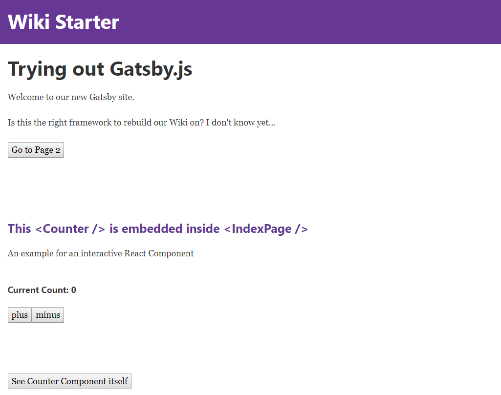
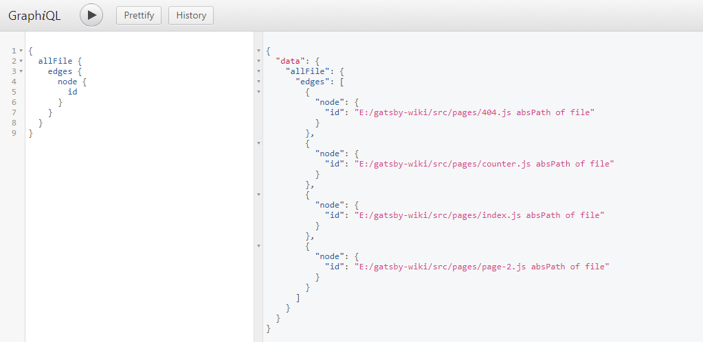
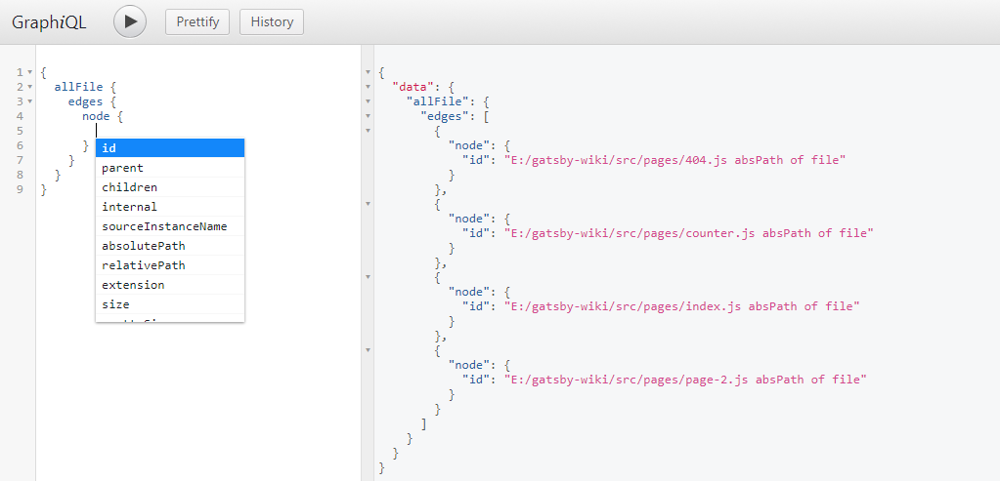
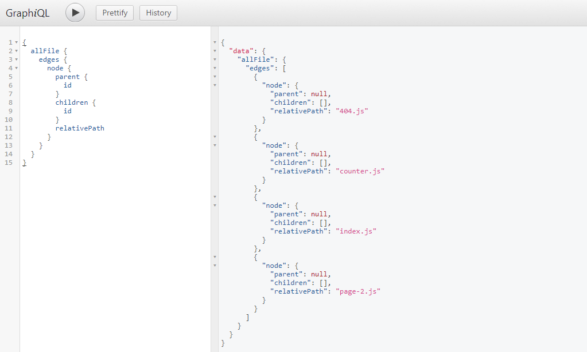
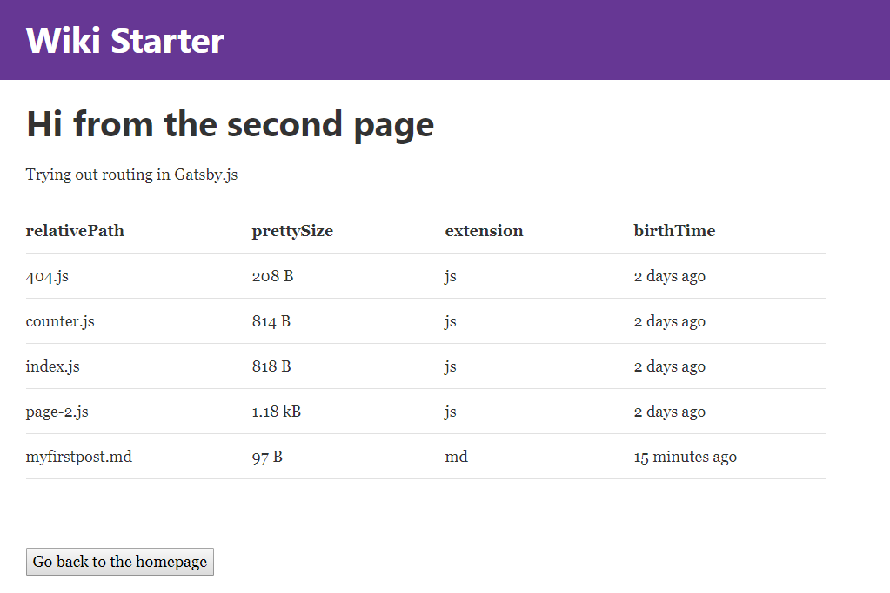
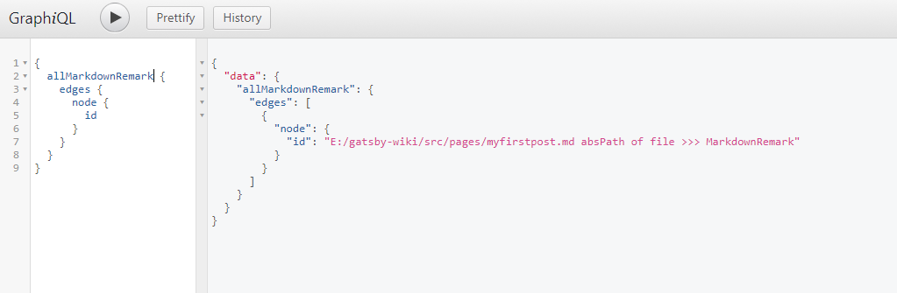
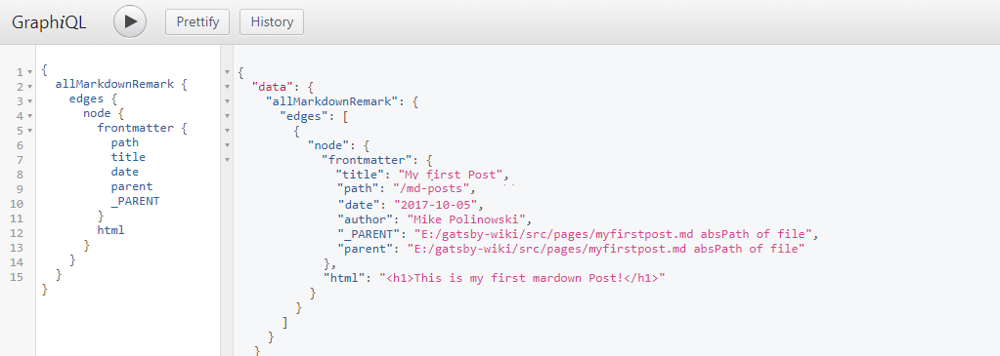

# gatsby-starter-default
The default Gatsby starter

For an overview of the project structure please refer to the [Gatsby documentation - Building with Components](https://www.gatsbyjs.org/docs/building-with-components/)

Install this starter (assuming Gatsby is installed) by running from your CLI:
```
gatsby new gatsby-wiki
```

1. [Start your Gatsby Development Environment](#01-start-your-gatsby-development-environment)
2. [Adding Content and Linking Pages](#02-adding-content-and-linking-pages)
3. [Styling your JSX](#03-styling-your-jsx)
4. [Adding Interactive Components](#04-adding-interactive-components)
5. [Importing Components to your Sites](#05-importing-components-to-your-sites)
6. [Passing down Props](#06-passing-down-props)
7. [Gatsby Plugins](#07-gatsby-plugins)
8. [Single Page Application](#08-single-page-application)
9. [GraphQL](#09-graphql)
10. [Adding File Data](#10-adding-file-data)
11. [Working with Markdown](#11-working-with-markdown)
12. [Build the Static Page](#12-build-the-static-page)
---


## 01 Start your Gatsby development environment


Now change into your site directory and run the Gatsby development environment using npm:

```
cd gatsby-wiki

npm run development
```

You can now access your website on http://localhost:8000 :


## 02 Adding content and Linking Pages


The */src/pages/index.js* file contains regular JSX - add any HTML inside the /<div/> tag to make it appear inside your website (Gatsby is hot-reloading).

```js
import React from 'react'
import Link from 'gatsby-link'

const IndexPage = () => (
  <div>
    <h1>Hi people</h1>
    <p>Welcome to your new Gatsby site.</p>
    <p>Now go build something great.</p>
    <Link to="/page-2/">Go to page 2</Link>
  </div>
)

export default IndexPage
```

You need to import Link from gatsby-link to use the Link Component and link to other pages - above you see the:

```html
<Link to="/page-2/">Go to page 2</Link>
```

component, linking our **index.js** page to another page inside the same folder with the name **page-2.js**. Every js file inside the */src/pages* folder will automagically be routed by Gatsby!


## 03 Styling your JSX


You can use simply add inline styles to your component, e.g.

```js
const IndexPage = () => (
  <div style={{color: 'tomato', background: 'blue'}}>
    <h1>Hi people</h1>
    <p>Welcome to your new Gatsby site.</p>
    <p>Now go build something great.</p>
    <Link to="/page-2/">Go to page 2</Link>
  </div>
)
```

For some advanced styles check out the Gatsby plugins [Glamor](https://www.gatsbyjs.org/packages/gatsby-plugin-glamor/) or [Styled Components](https://www.gatsbyjs.org/packages/gatsby-plugin-styled-components/).

How to install those plugins is explained below - [Gatsby Plugins](#07-gatsby-plugins) .


## 04 Adding Interactive Components


React allows you to add interaction to your page - we want to add a counter, set it's state to 0 on load and have two buttons that use onClick events to increment or decrement the state of the counter.

We can just add a new file */src/pages/counter.js* and link to it from the index page *\<Link to="/counter/"\>Go to Counter\</Link\>*:

```js
import React from 'react'

class Counter extends React.Component {
  constructor() {
    super()
    this.state = { count: 0 }
  }
  render() {
    return <div>
            <h1>Counter</h1>
            <p>current count: {this.state.count}</p>
            <button onClick={() => this.setState({ count: this.state.count + 1 })}>plus</button>
            <button onClick={() => this.setState({ count: this.state.count - 1 })}>minus</button>
          </div>
  }
}

export default Counter
```


## 05 Importing Components to your Sites


So far, we used every file inside the pages directory as a separate site. But React.js allows us to take the default component - that is exported at the bottom of the file - and import it into another page. For example, we could take the \<Counter /\> component above and add it to the index page (instead of just linking to it).

We just need to add an import line to the beginning of /src/pages/index.js:

```js
import React from 'react'
import Link from 'gatsby-link'

import Counter from './counter'
```

And reference the Counter inside the JSX code of index.js, like this:

```js
const IndexPage = () => (
  <div>
    <h1>Hi people</h1>
    <p>Welcome to your new Gatsby site.</p>
    <p>Now go build something great.</p>
    <Link to="/page-2/">Go to Page 2</Link><br/><br/>
    <Counter />
  </div>
)
```





## 06 Passing down Props


We can now pass properties, from the parent component, down to the Counter component - e.g. we can change the title of our counter, depending on the page it is displayed on:


### Changing Headers

```js
<Counter header="This is the Index Counter" />
```

The prop header is now available to the render function inside the Counter component. Now we can get different headers for our Counter component, depending on the parent component that called it - awesome!

```js
render() {
  return <div>
          <h3>{this.props.header}</h3>
          <p>current count: {this.state.count}</p>
          <button onClick={() => this.setState({ count: this.state.count + 1 })}>plus</button>
          <button onClick={() => this.setState({ count: this.state.count - 1 })}>minus</button>
        </div>
}
```


### Changing Styles

The same goes with styles - if we want the header to match the colour scheme of our parent component, we can just pass down a color prop to the Counter component:

```js
<Counter header="This is the Index Counter" color="rebeccapurple" />
```

And add the necessary inline styles in the component itself:

```js
render() {
  return <div>
          <h3 style={{color: this.props.color}}>{this.props.header}</h3>
          <p>current count: {this.state.count}</p>
          <button onClick={() => this.setState({ count: this.state.count + 1 })}>plus</button>
          <button onClick={() => this.setState({ count: this.state.count - 1 })}>minus</button>
        </div>
}
```


### Setting Default Props

To be able to still open the *localhost:8000/counter* URL, we now have to define a default prop inside the counter component - the header tag and font colour will be undefined, if there is no parent component passing down props! This can be done by Prop-Types, that we need to install:

```
npm install --save prop-types
```

Now we can import it into */src/pages/counter.js* :

```js
import React from 'react'
import PropTypes from 'prop-types'
```

And define a default value for the header prop below the Counter component (above the export statement):

```js
Counter.defaultProps = {
  header: 'Default Counter',
  color: 'black'
}
```


## 07 Gatsby Plugins

[Plugins](https://www.gatsbyjs.org/docs/plugins/) are Node.js packages that implement Gatsby APIs. They enable you to easily solve common website build problems e.g. setup Sass, add markdown support, process images, etc.


### Progress Animation

In this example, we want to use a plugin for [NProgress.js](http://ricostacruz.com/nprogress/) to add a loading animation to our site. You install the [NProgress plugin](https://www.gatsbyjs.org/packages/gatsby-plugin-nprogress/) with npm:

```
npm install --save gatsby-plugin-nprogress
```

Now we have to tell Gatsby to use the plugin by editing (creating if file doesn't exist) the gatsby-config.js file inside the root directory of our app. Coming from the starter template, we already have the react-helmet plugin installed (This plugin is described below: [Page Layout](#08-page-layout)). Now simply add the gatsby-plugin-nprogress to the array:

```js
module.exports = {
  siteMetadata: {
    title: `Gatsby Wiki`,
  },
  plugins: [
      `gatsby-plugin-react-helmet`,
      {
        resolve: `gatsby-plugin-nprogress`,
        options: {
          // Setting a color is optional.
          color: `rebeccapurple`,
          // Disable the loading spinner.
          showSpinner: false,
      }
    }
  ],
}
```

### Offline Support and Manifest

We now want to add a Serviceworker to our site that helps us cache important parts of our application, giving us a certain amount of offline support - as the [Offline Plugin](https://www.gatsbyjs.org/packages/gatsby-plugin-offline/) tells us, we will also install the [Manifest Plugin](https://www.gatsbyjs.org/packages/gatsby-plugin-manifest/) (make sure, that it is listed before the Offline Plugin!).

```
npm install --save gatsby-plugin-manifest

npm install --save gatsby-plugin-offline
```

Now we add them to our Gatsby configuration:


```js
module.exports = {
  siteMetadata: {
    title: `Gatsby Wiki`,
  },
  plugins: [
      `gatsby-plugin-react-helmet`,
      {
        resolve: `gatsby-plugin-nprogress`,
        options: {
          // Setting a color is optional.
          color: `rebeccapurple`,
          // Disable the loading spinner.
          showSpinner: false,
      }
    },
    {
    resolve: `gatsby-plugin-manifest`,
      options: {
          name: "Gatsby Wiki",
          short_name: "Gatsby Wiki",
          start_url: "/",
          background_color: "white",
          theme_color: "rebeccapurple",
          display: "minimal-ui",
          icons: [
            {
              // Everything in /static will be copied to an equivalent
              // directory in /public during development and build, so
              // assuming your favicons are in /static/favicons,
              // you can reference them here
              src: `/apple-touch-icon.png`,
              sizes: `180x180`,
              type: `image/png`,
            },
            {
              src: `/favicon.ico`,
              sizes: `256x256`,
              type: `image/png`,
            },
          ],
        },
      },
      `gatsby-plugin-offline`,
  ],
}
```


## 08 Single-Page-Application

Gatsby offers an easy way to create Single-Page-Applications (**SPA's**) with it's layout feature. You can find the JSX and CSS inside */src/layout*. The Gatsby Starter, that we are using, already uses a header navbar, that is defined inside the index.js file (and comes with the necessary css).

You can see that the app already uses [React-Helmet](https://github.com/nfl/react-helmet) as a Gatsby plugin. This reusable React component will manage all of your changes to the document \<head\>. Helmet takes plain HTML tags and outputs plain HTML tags.

The layout defines a \<Header /\> component, that - together with the \<Helmet /\> component - is used inside the \<TemplateWrapper /\>

All your content, from the pages that we created so far, is then injected into the Wrapper via the {children} tag. This way, you can create top-navbars, headers, side-navigations and footers, that are then displayed on all of your websites.


## 09 GraphQL

We can define some global variables inside gatsby-config.js in the root directory of our app:

```js
module.exports = {
  siteMetadata: {
    title: `Gatsby Wiki`,
    author: `Mike Polinowski`,
    description: `Trying out Gatsby`
  }
}
```

This Data will be available to every page and can be queried usind **GraphQL**. Just add the following GraphQL query to */src/pages/index.js*, to get a hold of those values:

```js
export const query = graphql`
  query FirstQuery {
    site {
      siteMetadata {
        title
        author
        description
      }
    }
  }
`
```

Then we have to inject this **{data}** into the parent component \<IndexPage /\>:

```js
const IndexPage = ({data}) =>
```

Now we are able to query this data inside the component:

```js
<h1>{data.site.siteMetadata.description}</h1>
```

Why is it **data.site.siteMetadata**? Gatsby's graphql debugger is running at http://localhost:8000/___graphql you can also use it to test your queries and see how the results look. Just open the debugger and try out our previous query:


## 10 Adding File Data

With Gatsby you can use GraphQL to query Data from your files directly. Transformer plugins transform File nodes into various other types of data e.g. [gatsby-transformer-json](https://www.gatsbyjs.org/packages/gatsby-transformer-json/) transforms JSON files into JSON data nodes and [gatsby-transformer-remark](https://www.gatsbyjs.org/packages/gatsby-transformer-remark/) transforms markdown files into MarkdownRemark nodes from which you can query an HTML representation of the markdown.

In this case we will use [gatsby-source-filesystem](https://www.gatsbyjs.org/packages/gatsby-source-filesystem/) to create file nodes from our file system.

```
npm install --save gatsby-source-filesystem
```

After installation, add the plugin to gatsby-config.js. You can have multiple instances of this plugin to read source nodes from different locations on your filesystem.

The following sets up the Jekyll pattern of having a *pages* directory for **Markdown files** and a *data* directory for **.json**, **.yaml**, **.csv**.:

```js
{
  resolve: `gatsby-source-filesystem`,
  options: {
    name: `pages`,
    path: `${__dirname}/src/pages/`,
  },
},
{
  resolve: `gatsby-source-filesystem`,
  options: {
    name: `data`,
    path: `${__dirname}/src/data/`,
  },
}
```

You can now open the GraphiQL debugger put in curly brackets - when you start typing allFiles, it should offer autocompletion. Just press enter to accept and **CTRL + ENTER** again to fill out the query for all page ID's:

```
{
	allFile {
	  edges {
	    node {
	      id
	    }
	  }
	}
}
```





When you delete *id* and press **CTRL + SPACE**, you will be given a drop down menu with all options that you can query:





Using the *parent*, *children* and *relativePath* attribute enables you to create e.g. a breadcrumb navigation:





We can now add a GraphQL query to */src/pages/page-2.js* to loop through all of our pages and display some data:

```js
export const query = graphql`
  query MyFilesQuery {
    allFile {
      edges {
          node {
            relativePath
            prettySize
            extension
            birthTime(fromNow: true)
        }
      }
    }
  }
`
```

Don't forget to inject the **{data}** to the page component:

```js
const SecondPage = ({data}) =>
```

Now we can add some JSX that loops through all of our files and outputs the information inside a \<table\>

```js
<table>
  <thead>
    <tr>
      <th>relativePath</th>
      <th>prettySize</th>
      <th>extension</th>
      <th>birthTime</th>
    </tr>
  </thead>
  <tbody>
    {data.allFile.edges.map(({node}, index) =>
      <tr key={index}>
        <td>
          {node.relativePath}
        </td>
        <td>
          {node.prettySize}
        </td>
        <td>
          {node.extension}
        </td>
        <td>
          {node.birthTime}
        </td>
      </tr>
    )}
  </tbody>
</table>
```





## 11 Working with Markdown

Now we are able to access information about all of our pages. But as mentioned, in the beginning of the last paragraph, we are also able to use **Gatsby Transformer Plugins** to look into files and make their content available to GraphQL.

In this case we want to use Markdown files and transform them, to be able to display their content in our website. The Transformer Plugin needed for this is [gatsby-transformer-remark](https://www.gatsbyjs.org/packages/gatsby-transformer-remark/). First we need to install the plugin:

```
npm install --save gatsby-transformer-remark
```

Then create a markdown page inside */src/pages/myfirstpost.md* that contains some **FrontMatter** (metadata in the beginning of the file, that can later be queried by GraphQL) and some text:


```
---
title: "My first Post"
author: "Mike Polinowski"
---

# This is my first mardown Post!
```

Now we need to add the plugin to */gatsby-config.js* :

```
`gatsby-transformer-remark`,
```

Now we have Markdown available in GraphQL - as before, just start typing allMardownRemark (ENTER autocompletes) and then press **CTRL + ENTER** to complete your query:





Now we can query for the FrontMatter as well as the MD-to-HTML transformed content of each MD file we add to our pages folder:





## 12 Build the Static Page

We now want to move our website from the development environment to our webserver. Gatsby offers us a simple command to build render our React.js page into a static website:

```
npm run build
```

You can find the output inside the */public* folder of your Gatsby App.
