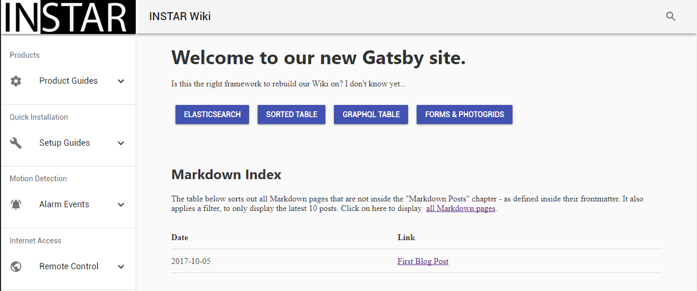

# This is my first markdown Post!

The image below is added by the __gatsby-transform-remark__ plugin __gatsby-remark-images__. It will automatically create resized copies of your image and embed them as src-set inside the HTML. You can configure this process in _gatsby-config.js_. For now, I just limited the image width to 930px.

Inline image syntax looks like this:

That is:

* An exclamation mark: !;
* followed by a set of square brackets, containing the alt attribute text for the image;
* followed by a set of parentheses, containing the URL or path to the image, and an optional title attribute enclosed in double or single quotes.

[Go back](/md-posts/)
